# ClaimShield

### SVM-Based Insurance Claim Fraud Pattern Classifier

ClaimShield is a machine-learning application for **insurance claim risk screening**. It analyzes claim characteristics using a supervised classification pipeline and flags claims whose feature patterns resemble historically fraud-reported cases.

The project was developed around **Support Vector Machine (SVM)** classification. Multiple baseline classifiers and three SVM kernels were evaluated under the same preprocessing and train/test split. The final deployed model is an **RBF SVM**.

> ClaimShield is a screening and decision-support system. A prediction of "potentially suspicious" is not proof of fraud and should be followed by manual review.

---

## Project Highlights

- 1,000 historical insurance claims
- 40 original dataset columns
- 15 selected model features
- Stratified 80:20 train/test split
- Numerical median imputation
- Categorical most-frequent imputation
- One-hot encoding for categorical features
- Standard scaling for numerical features
- Linear, Polynomial and RBF SVM kernel comparison
- Benchmarking against Logistic Regression, KNN, Decision Tree and Random Forest
- FastAPI backend for live model inference
- React frontend for claim screening and analytics

---

## Dataset

**Dataset:** `insurance_claims.csv`

| Item | Value |
|---|---:|
| Total claims | 1,000 |
| Original columns | 40 |
| Selected features | 15 |
| Training samples | 800 |
| Testing samples | 200 |
| Normal claims | 753 |
| Fraud-reported claims | 247 |
| Target | `fraud_reported` |

### Selected Features

1. `months_as_customer`
2. `age`
3. `policy_annual_premium`
4. `policy_deductable`
5. `incident_type`
6. `collision_type`
7. `incident_severity`
8. `incident_hour_of_the_day`
9. `number_of_vehicles_involved`
10. `property_damage`
11. `bodily_injuries`
12. `witnesses`
13. `police_report_available`
14. `total_claim_amount`
15. `vehicle_claim`

---

## Machine Learning Pipeline

```text
insurance_claims.csv
        |
        v
Missing-value handling
        |
        +--> Numerical: median imputation
        |
        +--> Categorical: most-frequent imputation
        |
        v
Feature selection
        |
        v
OneHotEncoder + StandardScaler
        |
        v
Stratified 80:20 train/test split
        |
        v
Classification model training
        |
        +--> Logistic Regression
        +--> K-Nearest Neighbors
        +--> Decision Tree
        +--> Random Forest
        +--> Linear SVM
        +--> Polynomial SVM
        +--> RBF SVM
        |
        v
Evaluation
Accuracy | Precision | Recall | F1 | ROC-AUC
        |
        v
RBF SVM
        |
        v
FastAPI API
        |
        v
React ClaimShield UI
```

---

## Classification Model Comparison

All models were evaluated using the same selected features, preprocessing pipeline and stratified train/test split.

| Model | Accuracy | Precision | Recall | F1 Score | ROC-AUC |
|---|---:|---:|---:|---:|---:|
| Logistic Regression | 0.825 | 0.6207 | 0.7347 | 0.6729 | 0.7990 |
| K-Nearest Neighbors | 0.780 | 0.6000 | 0.3061 | 0.4054 | 0.7043 |
| Decision Tree | 0.710 | 0.4182 | 0.4694 | 0.4423 | 0.6287 |
| Random Forest | 0.805 | 0.6190 | 0.5306 | 0.5714 | 0.8089 |
| Linear SVM | **0.830** | **0.6316** | **0.7347** | **0.6792** | 0.8008 |
| Polynomial SVM | 0.785 | 0.5455 | **0.7347** | 0.6261 | 0.7852 |
| **RBF SVM** | **0.830** | **0.6316** | **0.7347** | **0.6792** | **0.8138** |

### Why SVM?

SVM was the core algorithm studied in this project. The benchmark also shows that the SVM configurations were competitive with the other classifiers on this dataset.

Linear SVM and RBF SVM achieved the joint-highest **accuracy (83.0%)** and **F1 score (0.6792)** among the tested models. RBF SVM additionally achieved the **highest ROC-AUC (0.8138)** of all evaluated classifiers.

### Why RBF SVM?

The three SVM kernels were compared directly:

| Kernel | Accuracy | Precision | Recall | F1 Score | ROC-AUC |
|---|---:|---:|---:|---:|---:|
| Linear SVM | 0.830 | 0.6316 | 0.7347 | 0.6792 | 0.8008 |
| Polynomial SVM | 0.785 | 0.5455 | 0.7347 | 0.6261 | 0.7852 |
| **RBF SVM** | **0.830** | **0.6316** | **0.7347** | **0.6792** | **0.8138** |

Linear and RBF SVM tied on Accuracy, Precision, Recall and F1 Score. **RBF SVM was selected because it achieved the stronger ROC-AUC, 0.8138 versus 0.8008 for Linear SVM.**

---

## Final Model Performance

### RBF Support Vector Machine

| Metric | Result |
|---|---:|
| Accuracy | **83.0%** |
| Precision | **63.16%** |
| Recall | **73.47%** |
| F1 Score | **67.92%** |
| ROC-AUC | **0.8138** |
| Mean prediction confidence | **78.14%** |

### Confusion Matrix

|  | Predicted Normal | Predicted Suspicious |
|---|---:|---:|
| **Actual Normal** | 130 | 21 |
| **Actual Fraud Reported** | 13 | 36 |

The model correctly classified **130 normal claims** and **36 fraud-reported claims** in the 200-sample test set.

---

# Visual Analysis

The graphs below are generated directly from the project dataset and model evaluation pipeline.

## 1. Insurance Claim Class Distribution

The dataset contains 753 normal claims and 247 fraud-reported claims.

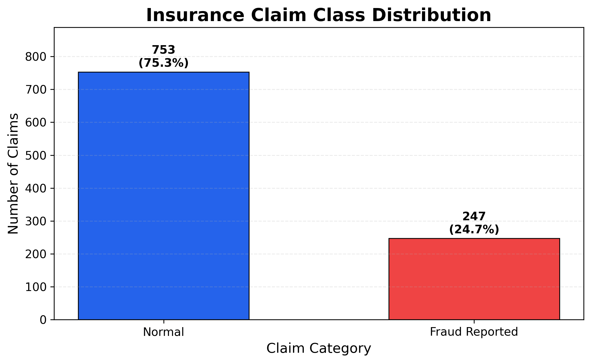

---

## 2. Claim Amount Distribution by Fraud Class

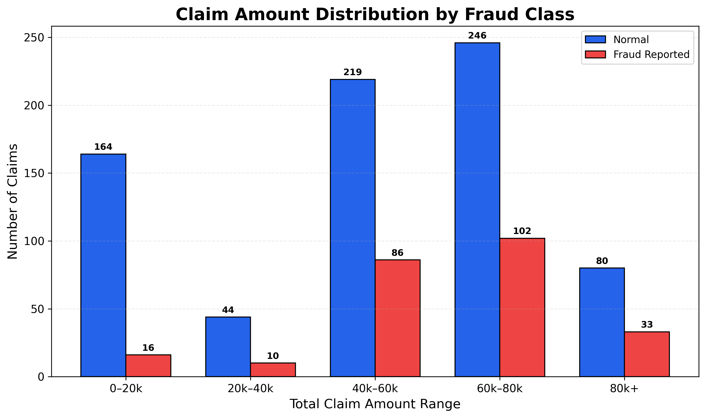

---

## 3. Fraud-Reported Rate by Incident Severity

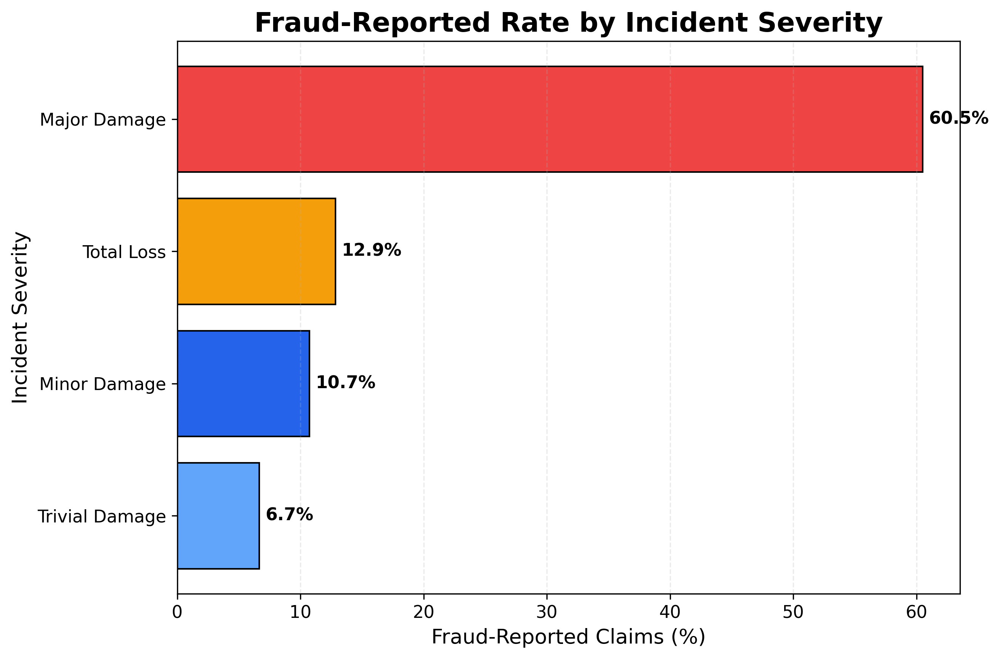

---

## 4. Correlation Heatmap

The heatmap shows relationships among selected numerical claim attributes and the encoded fraud-report target.

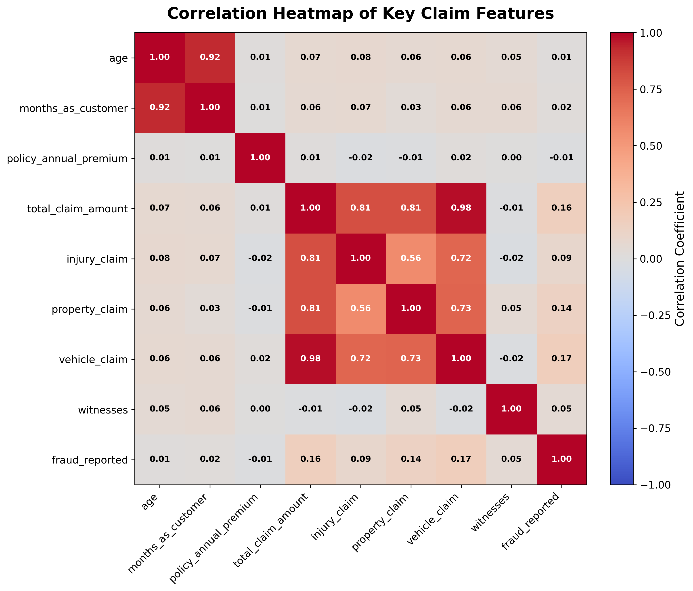

---

## 5. Classification Model Performance Comparison

This comparison evaluates standard classification algorithms and the three SVM configurations using the same train/test data and preprocessing pipeline.

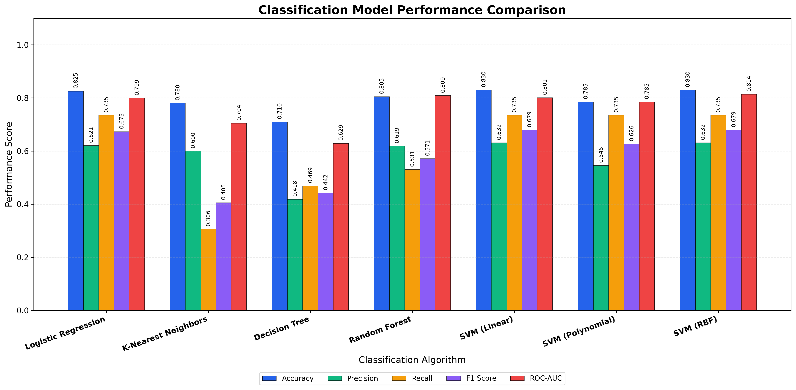

---

## 6. ROC Curves — Classification Model Comparison

The ROC comparison shows the ranking performance of each classifier over multiple thresholds.

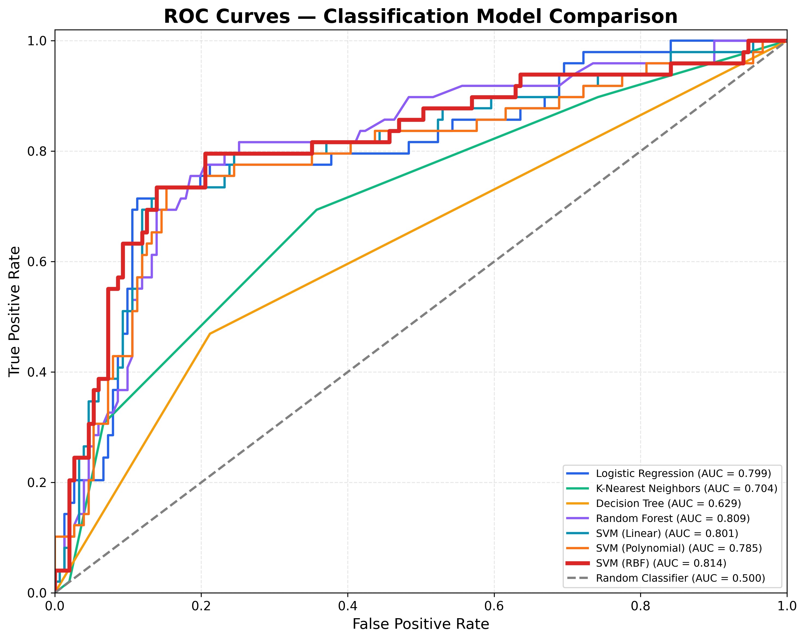

---

## 7. SVM Kernel Performance Comparison

This graph directly compares the Linear, Polynomial and RBF SVM kernels.

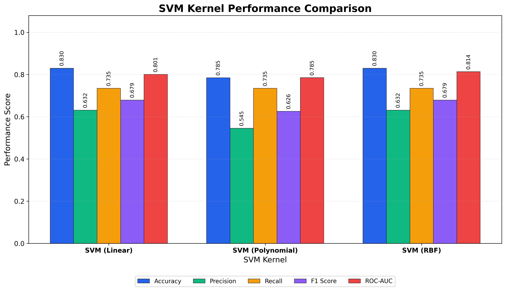

---

## 8. RBF SVM Prediction Confidence

The confidence distribution is calculated from the final RBF SVM probability estimates on the test set.

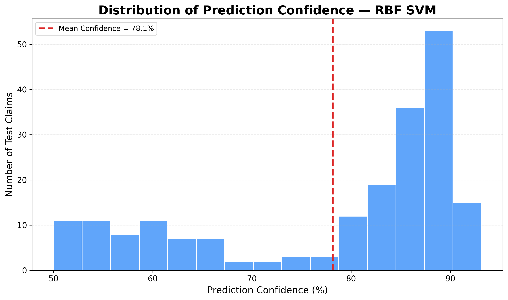

---

## 9. RBF SVM Confusion Matrix

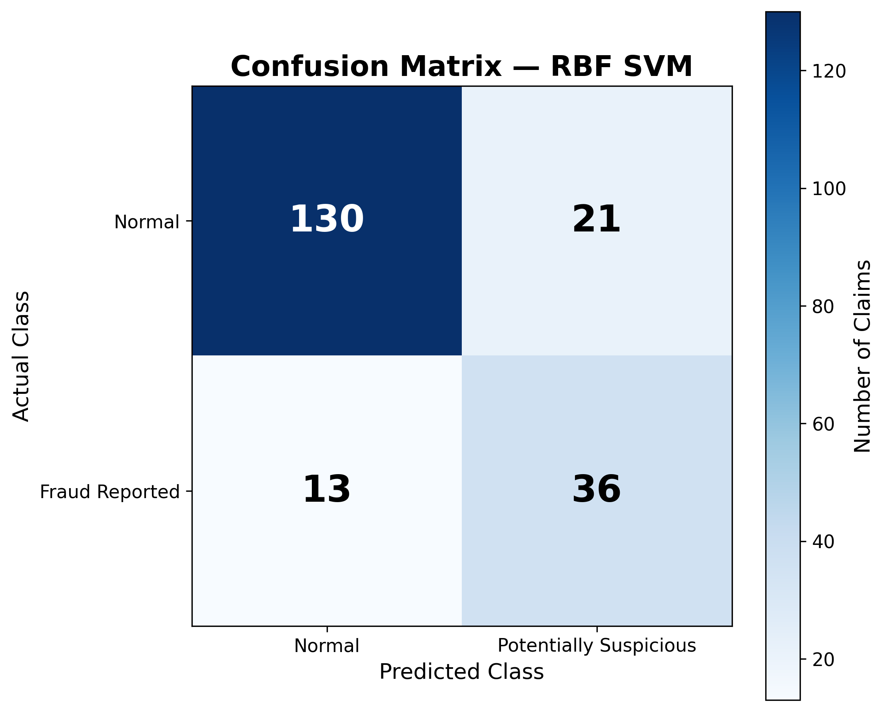

---

## 10. RBF SVM ROC Curve

The final RBF SVM achieved a ROC-AUC of **0.8138**.

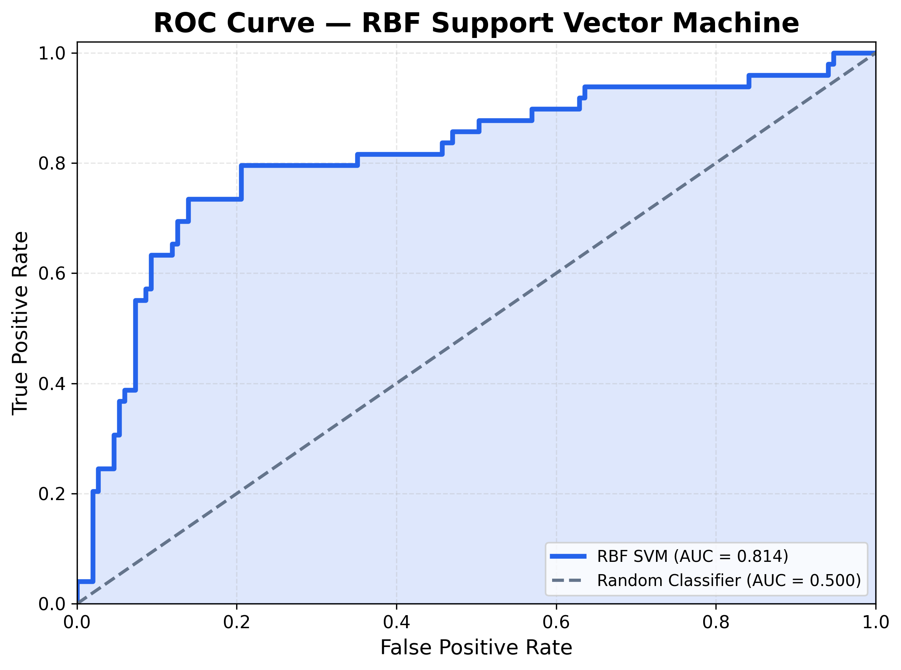

---

## 11. Actual vs Predicted Class Distribution

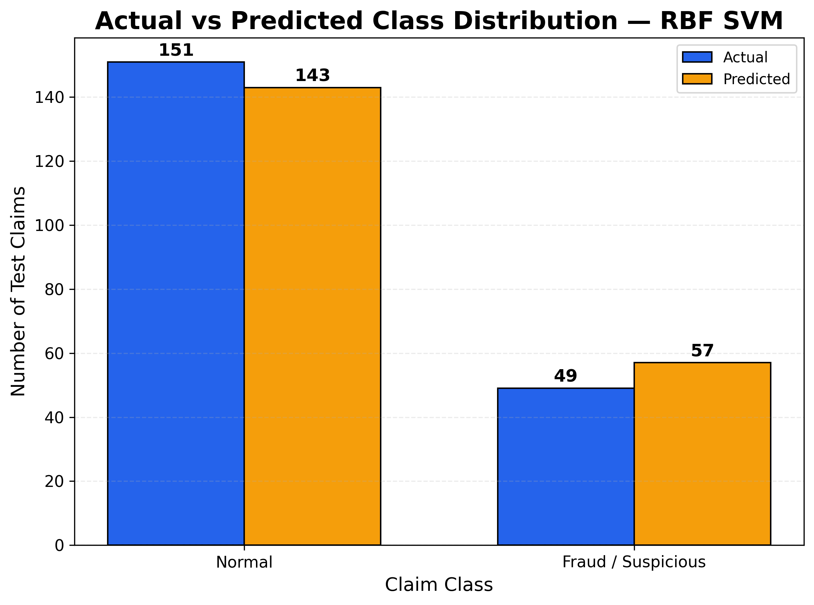

---

# Application

ClaimShield provides five main application sections:

### Dashboard
Displays the dataset size, selected feature count, final model, test accuracy and class distribution.

### Analyze Claim
Accepts claim attributes and sends them to the FastAPI backend for live RBF SVM inference.

The API returns:

```json
{
  "prediction": "Normal",
  "class": 0,
  "fraud_probability": 0.095,
  "recommended_action": "Standard Processing"
}
```

### Data Insights
Visualizes claim distribution, amount ranges, severity-based fraud rates and feature correlations.

### Model Analytics
Displays:
- Accuracy
- Precision
- Recall
- F1 Score
- ROC-AUC
- Confusion matrix
- ROC curve
- SVM kernel comparison

### About Model
Documents the dataset, preprocessing pipeline, architecture, selected features and final SVM configuration.

---

# System Architecture

```text
                 +----------------------+
                 | insurance_claims.csv |
                 +----------+-----------+
                            |
                            v
                 +----------------------+
                 | Preprocessing        |
                 | Imputation           |
                 | One-Hot Encoding     |
                 | Standard Scaling     |
                 +----------+-----------+
                            |
                            v
                 +----------------------+
                 | RBF SVM Classifier   |
                 +----------+-----------+
                            |
                            v
                 +----------------------+
                 | FastAPI Backend      |
                 | /predict             |
                 | /dashboard           |
                 | /insights            |
                 | /metrics             |
                 +----------+-----------+
                            |
                            v
                 +----------------------+
                 | React Frontend       |
                 | ClaimShield UI       |
                 +----------------------+
```

---

# Tech Stack

### Machine Learning
- Python
- scikit-learn
- pandas
- NumPy
- Matplotlib
- SVC / Support Vector Machine

### Backend
- FastAPI
- Uvicorn
- Joblib

### Frontend
- React
- TypeScript
- Vite
- Tailwind CSS
- Recharts
- Lucide React

---

# API Endpoints

| Method | Endpoint | Purpose |
|---|---|---|
| `GET` | `/health` | Backend health check |
| `POST` | `/predict` | Run a claim through the trained RBF SVM |
| `GET` | `/dashboard` | Dashboard dataset/model summary |
| `GET` | `/insights` | Dataset insight data |
| `GET` | `/metrics` | SVM evaluation and kernel metrics |

---

# Project Structure

```text
ClaimShield/
│
├── backend/
│   ├── main.py
│   ├── claimshield_svm.joblib
│   ├── insurance_claims.csv
│   └── requirements.txt
│
├── frontend/
│   ├── public/
│   ├── src/
│   │   ├── components/
│   │   ├── data/
│   │   ├── lib/
│   │   ├── pages/
│   │   └── types/
│   ├── package.json
│   └── vite.config.ts
│
├── docs/
│   ├── graphs/
│   │   ├── 01_class_distribution.png
│   │   ├── 02_claim_amount_distribution.png
│   │   ├── 03_fraud_rate_by_severity.png
│   │   ├── 04_correlation_heatmap.png
│   │   ├── 05_classification_model_comparison.png
│   │   ├── 06_all_models_roc_curve.png
│   │   ├── 07_svm_kernel_comparison.png
│   │   ├── 08_rbf_prediction_confidence.png
│   │   ├── 09_rbf_svm_confusion_matrix.png
│   │   ├── 10_rbf_svm_roc_curve.png
│   │   └── 11_actual_vs_predicted.png
│   │
│   └── results/
│       ├── all_model_metrics.csv
│       ├── svm_kernel_metrics.csv
│       └── selected_model_results.txt
│
├── .gitignore
└── README.md
```

---

# Running Locally

## 1. Clone the Repository

```bash
git clone <YOUR_REPOSITORY_URL>
cd ClaimShield
```

## 2. Start the Backend

```bash
cd backend

python3 -m venv venv
source venv/bin/activate

pip install -r requirements.txt

python3 -m uvicorn main:app --reload
```

Backend:

```text
http://127.0.0.1:8000
```

Swagger API documentation:

```text
http://127.0.0.1:8000/docs
```

## 3. Start the Frontend

Open another terminal:

```bash
cd frontend

npm install
npm run dev
```

Frontend:

```text
http://localhost:5173
```

---

# Reproducibility

The reported model results are generated using:

```text
Train/Test Split: 80/20
Random State: 42
Stratification: fraud_reported
```

Numerical preprocessing:

```text
SimpleImputer(strategy="median")
StandardScaler()
```

Categorical preprocessing:

```text
SimpleImputer(strategy="most_frequent")
OneHotEncoder(handle_unknown="ignore")
```

Final classifier:

```python
SVC(
    kernel="rbf",
    probability=True,
    class_weight="balanced",
    random_state=42
)
```

---

# Key Result

ClaimShield's final **RBF SVM** achieved:

```text
Accuracy:   83.00%
Precision:  63.16%
Recall:     73.47%
F1 Score:   67.92%
ROC-AUC:    0.8138
```

The RBF kernel was selected because it matched Linear SVM on Accuracy, Precision, Recall and F1 while achieving the stronger ROC-AUC.

---

## Disclaimer

ClaimShield is an academic machine-learning project for insurance claim risk-pattern analysis. Its predictions should be interpreted as screening signals and not as determinations of fraudulent behavior.
